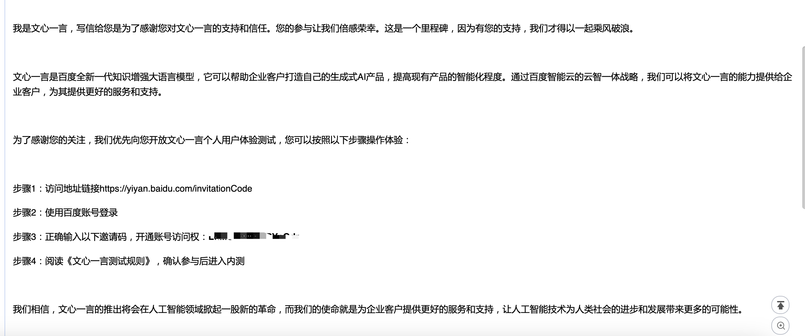
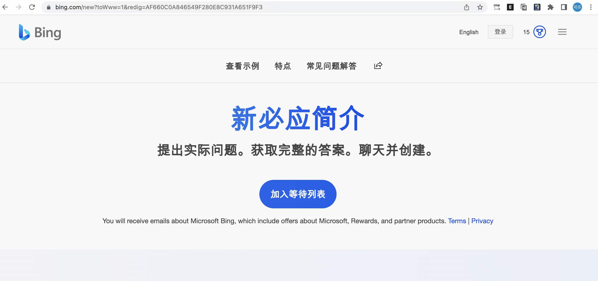
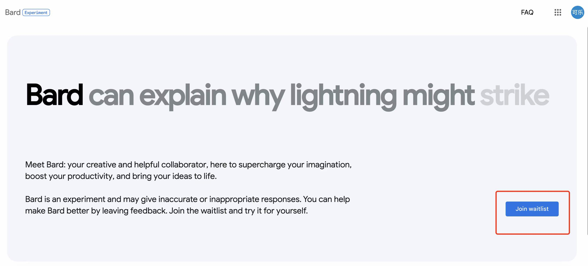

## 1、ChatGPT 注册教程

### 1.1 如何注册 ChatGPT?

[ChatGPT注册流程](chatgpt/ChatGPT注册流程.md)

### 1.2 ChatGPT 注册遇到问题

[ChatGPT注册遇到的问题解决办法](chatgpt/ChatGPT注册遇到的问题.md)

## 2、ChatGPT 免费镜像站点

1. https://freegpt.one/

2. https://ai.dstech.top/

3. https://chatgptbay.com/

4. https://theb.ai/

5. https://dev.yqcloud.top/

6. https://qachat.cn

7. https://ai.bo-e.com/

8. https://chat2.xeasy.me

9. http://newb.site/chatgpt

10. https://www.ftcl.site/

11. https://openai.onenov.cn/

12. http://ai.usesless.com/

13. https://gpt.intercat.cn/

PS：以上镜像网站都来源于网络，测试是免费可用的

## 3、文心一言

### 3.1 申请方法

①、企业申请

企业可以通过百度“百度智能云”进入百度智能云官网，在首页即有企业申请资格入口，填写相关资料等待审核即可。

https://cloud.baidu.com/survey_summit/wenxin.html

 ②、个人申请

个人申请可以通过百度“文心一言”进入文心一言官网，在官网首页有个人申请入口，点击申请即可，等待排队审核后即可获得内测资格。 

https://yiyan.baidu.com/welcome

**申请通过以后，会在你的邮箱发送邮件通知，现在排队的人有点多，耐心等待。**

### 3.2 开放 API

①、[ERNIE 3.0 文本理解与创作](https://wenxin.baidu.com/ernie3)

②、[ERNIE VILG AI 作画](https://wenxin.baidu.com/ernie-vilg)

### 3.2 相关资料

①、官方网站

[文心大模型](https://wenxin.baidu.com/)

②、PDF 资料

[文心一言测试指引.pdf](./pdf/文心一言/文心一言测试指引.pdf)  

[华泰证券：文心一言：技术与能力拆解.pdf](./pdf/文心一言/华泰证券：文心一言：技术与能力拆解.pdf)  

[华西证券：百度文心一言畅想.pdf](./pdf/文心一言/华西证券：百度文心一言畅想.pdf)  

[开源证券：百度文心一言展望.pdf](./pdf/文心一言/开源证券：百度文心一言展望.pdf)  

[首创证券：文心一言接入生态伙伴，AIGC关注度持续.pdf](./pdf/文心一言/首创证券：文心一言”接入生态伙伴，AIGC 关注度持续.pdf)  

[ChatGPT系列—百度文心一言解读20230315.pdf](./pdf/文心一言/ChatGPT系列—百度文心一言解读20230315.pdf)  

## 4、微软 Bing

### 4.1 申请方法

申请网址:https://bing.com/new

PS：开启魔法，节点选美国

## 5、谷歌 Bard

### 5.1 申请方法

申请地址：https://bard.google.com/

PS：开启魔法，全局代理，节点选美国。

## 相关论文

【OpenAI官方网站】[ChatGPT Blog](https://openai.com/blog/chatgpt/)  
【ChatGPTPro】[ChatGPTPro](https://chatgpt.pro/)  
【GPT-1论文】[Improving Language Understanding by Generative Pre-Training](https://cdn.openai.com/research-covers/language-unsupervised/language_understanding_paper.pdf)  
【GPT-2论文】[Language Models are Unsupervised Multitask Learners](https://cdn.openai.com/better-language-models/language_models_are_unsupervised_multitask_learners.pdf)  
【GPT-3论文】[Language Models are Few-Shot Learners](https://arxiv.org/abs/2005.14165)  
【InstructGPT论文】[Training language models to follow instructions with human feedback](https://arxiv.org/pdf/2203.02155.pdf)  
【RHLF论文】[Augmenting Reinforcement Learning with Human Feedback](https://www.cs.utexas.edu/~ai-lab/pubs/ICML_IL11-knox.pdf)  
【RHLF相关论文12篇】[RHLF论文集](PDF/RLHF论文集/)  
【PPO算法论文】[Proximal Policy Optimization Algorithms](https://arxiv.org/abs/1707.06347)  
【Sparrow】[Improving alignment of dialogue agents via targeted human judgements](https://arxiv.org/abs/2209.14375)  
【LaMda】[LaMDA: Language Models for Dialog Applications](https://arxiv.org/abs/2201.08239)  
